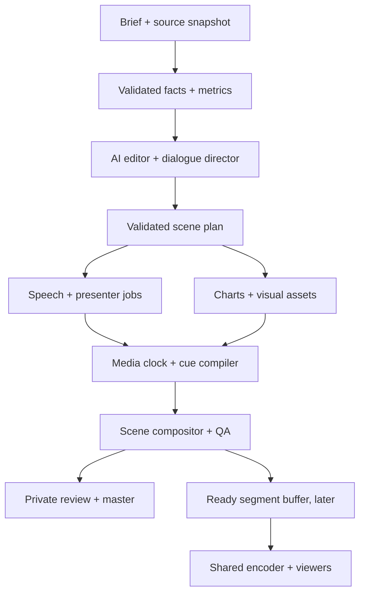

# AI-first broadcast execution plan — V2

Status: **planned; implementation has not started**. Updated 10 October 2026.

Repository: `waseem99/Money-24-7`. Audited main: `da9758bfa025b7e59256c0c9ed65892728e2206c` (PR #16).

This extends [the five-minute approval plan](../FIVE_MINUTE_NEWSROOM_PLAN.md). The immediate deliverable remains a convincing five-minute recording for Umar bhai. Animated broadcast layouts, an unequal two-presenter view and programmatic financial charts are now explicit pilot requirements. Exact walking/pointing is an experimental branch; shared continuous playout follows film approval. This plan does not assert that any new capability has been implemented.

Execution tasks and issue links: [BROADCAST_V2_BACKLOG.json](BROADCAST_V2_BACKLOG.json). The parent film acceptance remains [#6](https://github.com/waseem99/Money-24-7/issues/6); existing #7–#14 retain their history and acceptance ownership.

Master V2 tracker: [#17](https://github.com/waseem99/Money-24-7/issues/17).

| Task | GitHub issue | Delivery |
| --- | --- | --- |
| NR-01 | [#18](https://github.com/waseem99/Money-24-7/issues/18) | Contracts and migration |
| NR-02 | [#19](https://github.com/waseem99/Money-24-7/issues/19) | Animated layouts and renderer choice |
| NR-03 | [#20](https://github.com/waseem99/Money-24-7/issues/20) | Data, indicators and charts |
| NR-04 | [#21](https://github.com/waseem99/Money-24-7/issues/21) | AI editorial/director |
| NR-05 | [#22](https://github.com/waseem99/Money-24-7/issues/22) | Turns, reactions and capabilities |
| NR-06 | [#23](https://github.com/waseem99/Money-24-7/issues/23) | Timeline and composition |
| NR-07 | [#24](https://github.com/waseem99/Money-24-7/issues/24) | Actual 45-second scene |
| NR-08 | [#25](https://github.com/waseem99/Money-24-7/issues/25) | Movement experiment |
| NR-10 | [#26](https://github.com/waseem99/Money-24-7/issues/26) | Full pipeline/review integration |
| NR-09 | [#27](https://github.com/waseem99/Money-24-7/issues/27) | Post-approval buffered/Q&A trial |

## 1. Outcome and scope

Produce an original Signal programme with two consistent realistic presenters, natural questions and responses, moving listener reactions, accurate charts, clean transitions and coordinated graphics. A minimum of one seated-anchor/standing-analyst composition must be auditioned. If standing footage fails quality, record the limitation and obtain a creative decision; do not silently count a boxed headshot as this requirement.

AI-first means the brief and source snapshot drive automated story selection, explanations, dialogue, shot direction, motion/illustration prompts and revision suggestions. Code validates claims, calculates numbers, compiles timing, schedules bounded jobs and renders the programme. A person sets the visual direction, selects identities and evaluates the actual film. Manual imported clips remain an explicit fallback, with provenance and a logged reason. Routine per-scene prompt writing should not be necessary.

| Release | Required outcome | Boundary |
| --- | --- | --- |
| R1: graphics prototype | Six animated layouts, replay charts, ticker and reference-inspired unequal split | No paid avatars; visibly labelled synthetic/replay media |
| R2: conversation proof | 45-second finished scene with two real avatar performances, at least three turns, reaction footage and synchronized chart explanation | Actual provider/media evidence; not a whole show |
| R3: approval film | 300-second target master, 1080p30, captions, sources, timestamped QA and stakeholder response | Prepared generation allowed; no latency claim |
| R&D: physical movement | Comparable tests of standing/compositing, cinematic motion and controlled 3D pointing | Decision may reject a route; no blanket realism promise |
| R4: buffered channel | 30-minute measured pilot with failure injection, shared output and fresh question test | After R3; not 24/7 certification |

R1 and most code for R2/R3 can be developed without subscriptions. Real auditions need valid accounts/compatible assets or supplied rendered clips. R4 requires suitable hosted media infrastructure and applicable data display rights. These dependencies do not block R1.

## 2. Reference interpretation and visual direction

The five user screenshots establish composition and editorial hierarchy, not permission to reuse another network's identity, footage or market values. Do not commit the screenshots or presenter images to this public repository. Do not treat their numbers/headlines as current market evidence.

| Reference | Observable pattern | Signal implementation |
| --- | --- | --- |
| `image(20261010-125252).png` | Two presenters side by side, lower-third and ticker | `discussion-two` |
| `image(20261010-125302).png`, `125329` | Presenter left, market table right, large headline and stock strip | `presenter-board` |
| `image(20261010-125315).png` | Technical price chart with indicator panes on a studio display | `chart-full` plus shared chart component |
| `image(20261010-125536).png` | Narrow seated-anchor panel; wide standing-analyst/chart scene | `anchor-analyst-wall` |

Retain Signal's original navy/teal identity as the default, with brighter data surfaces for readability. Make palette, font, panel geometry, lower-third heights, motion and typography theme tokens so further user design suggestions require one controlled theme revision. No Schwab logos, presenter likenesses or programme names in production.

Six required templates:

1. `anchor-full`: single presenter, restrained studio background, name/headline/ticker.
2. `discussion-two`: 50/50 panels with speaker and listener states, individual name straps.
3. `presenter-board`: approximately 60/40 presenter/table, 4–6 instruments, price/change/percentage/time.
4. `anchor-analyst-wall`: approximately 28/72 split above the headline; large panel contains a standing analyst beside a programmatic screen. Screen text must remain legible after compositing.
5. `chart-full`: candlestick or line plot, volume and optional indicator panes, source/time and annotations.
6. `story-visual`: headline, approved supporting image or question card, optional presenter inset.

`presenter-chart` is a supported variation of the presenter-board template. A three-person panel is a schema/layout extension for testing; the approval film requires two, not three.

Initial design constraints: 1920×1080, 30 fps; 48 px minimum outer title-safe margin, excluding intentional edge-to-edge backgrounds; preserve a distinct ticker lane and caption safe area. Default essential data type at least 26 px at 1080p. Test 1280×720 and mobile playback without claiming dense technical-chart labels are readable at every reduced size. Move detailed charts full-screen when necessary. Use colour plus signs/arrows for direction. Default transitions 250–450 ms; avoid motion that hides a number while it is discussed. Reduced-motion preview and deterministic export timing must be supported.

## 3. Baseline audit and migration boundaries

| Existing file/component | Verified scope in source | V2 change |
| --- | --- | --- |
| `pilot/contracts.mjs` | Exactly two named roles, four layouts, 300 seconds, three-point bar chart; director preserves numeric tokens | Add explicit V2 contracts and a V1 adapter; claim validation must cover units/entities/context as well as digits |
| `pilot/graphics.mjs` | SVG frame rendered to PNG, cards/bar chart, equal split | Retain for V1; introduce frame-driven animated graphics |
| `pilot/compositor.mjs` | Loop PNG frames, overlay opaque clips/listener, timed text cues; FFmpeg master | Add versioned V2 scene renderer, alpha support and variable-duration sample composition |
| `pilot/providers.mjs` | ElevenLabs timed speech, HeyGen V3 audio/avatar jobs, Gateway dialogue/image generation | Capability-aware adapter; motion/alpha requests only when supported; preserve secrets and cost controls |
| `pilot/workflow.mjs`, `production.mjs`, `store.mjs` | Locks, durable jobs, budget reservations, resume, retakes and usage/timing records | Extend identities per turn/layer; bounded independent work; explicit readiness barrier |
| `pilot/media.mjs`, `archive.mjs` | Media integrity and anomaly checks, captions, approved master archival | Validate expected silence by layer/role; do not flag legitimate static charts as frozen presenter defects |
| `pilot/server.mjs`, `src/pilot.js` | Private local review, sources and hash-bound approval | V2 preview, synchronized event timeline, per-turn defects and revision evidence |
| Existing viewer/LiveAvatar integration | Single operator session and optional HLS adapter | Preserve; add centrally managed streaming experiment later rather than one paid session per viewer |

Do not rewrite the application in a new framework. Node 24, Vite, existing FFmpeg tooling and private SQLite worker remain the pilot base. Add an isolated renderer if needed. Keep V1 rendering available and ensure old approved outputs remain reproducible with their pinned renderer version.

Baseline evidence in [PILOT_VERIFICATION.md](../PILOT_VERIFICATION.md) reports 70 tests and synthetic media checks; those are historical implementation evidence, not V2 or real-provider certification. The last integrated fixture is exactly 300 seconds. Its encoding time does not measure AI latency.

## 4. Architecture

Control plane: brief, sources, director, turn scheduler, jobs, approval and metrics. Media plane: audio/video, chart rendering, compositing and shared playback. They communicate through validated versioned manifests rather than generated executable code. Vercel continues serving the frontend/control endpoints appropriate to it; media encoding and long-lived sessions use a private worker with persistent storage.

Independent jobs may execute concurrently within configured provider and spend limits. Model output cannot raise budgets, change credentials, choose arbitrary fetch destinations or execute JavaScript/shell. A missing required speech/video/graphic layer prevents a segment becoming ready. Optional imagery may use a preapproved fallback. Record the actual route selected.

## 5. Contracts to implement

Add `schemaVersion: 2`; never silently reinterpret V1 data. These are specification fields, not an assertion that the types exist today.

| Contract | Essential fields and invariants |
| --- | --- |
| `ShowBible` | themeVersion, language, audience, segmentTypes, tone, presenter profiles, allowed layouts/actions, pacing and disclosure rules |
| `SourceSnapshot` | id/hash, provider/source, instrument identifier, venue, instrument type, currency/unit, interval, eventTime, capturedAt, timezone, entitlement reference, revision, expiry; historical/synthetic/current classification |
| `Metric` | id, snapshotId, formulaVersion, inputs, result, precision, units, comparison basis, warm-up/missing-data status |
| `Claim` | id, source/metric IDs, subject, value/range, units, interval/asOf, qualifier; distinguish observed facts from interpretation; no unsupported causal certainty |
| `Presenter` | stable id/role, voice/look config references, wardrobe, eyeline, pronunciation, supported modes/matting/motion, private asset provenance |
| `Turn` | id, speakerId, text, claimIds, intended delivery, target duration, speech asset/alignment, listening roles; one active speaker by default |
| `Scene` | id, templateId/version, turnIds, slots/layers, snapshot bindings, chart spec, supporting assets, duration and transitions |
| `Cue` | id, action enum, turnId + spoken token span, targetId/seriesId/data coordinate, offsetMs, compiled programme time, fallback; no raw code |
| `Asset` | immutable hash, role, job/config version, actual dimensions/rate/codec/alpha, duration, audio origin, licence/provenance reference, QA, takes |
| `Programme` | revision, schemaVersion, sources/metrics/claims, presenters, scenes/turns, exact timeline, approvals, renderer/dependency hashes |
| `SegmentReadiness` | required assets ready, checks pass, valid-until, priority/deadline, no unresolved paid job, source revision, ready/expired/superseded state |

Minimum cue actions: `layout.set`, `speaker.activate`, `chart.reveal`, `chart.highlight`, `chart.range`, `board.highlight`, `headline.set`, `camera.cut`, `listener.react`. Physical `actor.gaze`, `actor.point`, `actor.move` are optional capability-gated actions for R&D. Unsupported actions must fail validation or use a declared visual fallback; never pretend a gesture was executed.

Pilot roster: two selected presenters; V2 must not hard-code `anchor`/`analyst` as the only allowed IDs. Validate a three-presenter synthetic sequence without requiring three paid identities. Keep role-to-provider configuration out of public media manifests where sensitive.

Single clock: compile events onto measured speech timing plus measured avatar offset, then programme sample/frame time. Store milliseconds in interchange and integer frame/audio-sample positions in the compiled timeline. Resolve pronunciation aliases against the spoken alignment while retaining editorial text for captions. Repeated phrases require explicit occurrence/token spans. No matching to the first accidental phrase or blind wall-clock timers. Seeking to a frame must reconstruct the complete scene state.

Revisions invalidate only dependent turns/scenes, cached render outputs and approval. Preserve approved master archives and original manifests; do not mutate aired/approved history. A new input hash must never silently replace an already approved take.

## 6. AI direction and validation

Versioned prompts: fact briefing, editorial outline, dialogue, scene direction, illustration/motion, and defect revision. Models generate JSON within approved templates. Persist input hashes, prompt versions, model, validated output and compact audit metadata. No hidden reasoning is required or stored.

Production sequence:

1. Normalize approved inputs and calculate numerical metrics deterministically.
2. Generate a story brief with claim IDs, uncertainty and intended visuals.
3. Generate one coordinated dialogue with distinct roles; avoid independent agents endlessly responding to each other.
4. Generate scene/cue choices and media prompts from that dialogue.
5. Validate schema, entity/number/unit/timeframe/qualifier agreement, duration, layout capabilities and exact source references.
6. Allow at most two structured repair attempts with explicit validation errors; then stop for a targeted review. Do not silently weaken checks.
7. Generate media with per-run reservations, bounded concurrency and preserved provider job IDs.
8. Compile actual timings, render, inspect and issue a revision request scoped to a failed turn/scene.

Examples of mandatory rejection: correct digits attached to wrong company; price movement confused with percentage points; futures symbol confused with cash index; expired quote narrated as current; unsupported reason asserted as established fact. A numerical-token match alone cannot certify factual correctness. Editorial review still evaluates meaning and interpretation for the pilot.

## 7. Data and graphics engine

Use fixed input snapshots for recorded segments. A separately timestamped ticker may consume newer data in the later live mode. Narration and analysis charts remain on their shared segment snapshot until an intentional transition. Corrections create a new revision and invalidate queued affected material.

Charts required for R1/R3: OHLC candlesticks, line/area, volume, percentage comparison, SMA/EMA; add RSI and MACD to match multi-pane reference analysis. Compute indicators in a tested module, with explicit periods, seeding/warm-up rules and rounding. Missing history produces unavailable values, never zero-filled fabricated signals. Validate timestamp ordering, OHLC bounds, session/timezone, duplicates, split-adjustment basis and prior-close denominator. Chart libraries render supplied values; they do not supply market data or calculate all analysis for us.

Recommended first chart candidate: Lightweight Charts in a browser renderer. It is client-side; use controlled Chromium for frame capture, not a Node-only direct invocation. Retain required attribution and verify the selected version's licence. Market board/labels/annotations use SVG/Canvas/DOM with exact layout and testable text.

Renderer decision in NR-02: benchmark browser-native frame-controlled rendering against an isolated Remotion composition if an appropriate licence is available. Do not assume a free commercial licence for the organization. Keep a common `renderScene(plan, timeMs)` contract and use a licensed native browser/FFmpeg route if Remotion is unavailable. Avoid adding two full independent template systems.

Determinism requirements: embed approved fonts, pin dependency/browser versions, disable uncontrolled CSS transitions, random values and wall-clock animation in export mode; seek charts without tweening to the prescribed state; wait for fonts/media/chart readiness before frame capture. Preview and MP4 should agree at event checkpoints. Do not claim pixel identity across different GPUs/encoders; define a toleranced image comparison in a pinned environment.

## 8. Presenters, reactions and shared studio

Two distinct problems: selecting a convincing performance and scheduling it convincingly. Real auditions remain in #8. The controller must ensure only the intended voice is mixed, listeners do not mouth an unrelated script, and a speaker handover follows measured audio completion.

Default dialogue: one speaker at a time; deliberate pauses, restrained reaction cues and no automatic overlap. Render complete coordinated exchanges as turns, not independent open microphones. Later interruption handling flushes queued speech, cancels future cues and reschedules affected content; it must not continue playing old speech behind the new speaker.

Build a provenance-tracked reaction library per selected presenter/look: neutral listen, small nod, attentive look and transition. Use clips that cover the required duration, selected without conspicuous repetition. Existing no-freeze/no-short-loop listener rule remains. If no acceptable listener is ready, cut to the active speaker or chart; report that choice. Automated generation of nonspeaking reactions is provider-dependent and must be tested before relying on it. Manual accepted reactions are a supported pilot fallback.

For `anchor-analyst-wall`, keep the chart a separately rendered surface. A standing video needs compatible framing, headroom, eyeline and lighting. Matting/alpha clips require alpha-preserving decode, intermediate format, compositing and edge QA. Opaque footage remains usable only in explicitly boxed layouts. Current provider background requests and compositor padding must not discard alpha. Match scale/perspective, shadow/occlusion and screen placement before calling a shared scene convincing.

Precise pointing is not a motion-prompt guarantee. R&D defines chart data coordinate -> screen pixel -> studio world coordinate, a reachable hand target and gaze target. Unreal/MetaHuman may use authored locomotion/gesture clips plus Control Rig IK; facial animation follows audio. This needs a suitable GPU environment, reusable rigged characters/set and animation review. A supported generated cinematic clip is an alternative for brief establishing motion, with exact chart content composited afterward only if tracking and occlusion can be verified.

## 9. Rendering, jobs and review

Keep the existing paid ledger, uncertainty reconciliation, resume and take archive behavior. Job identity extends to programme revision + turn/layer + input/config hashes. Persist attempts and provider IDs before polling; uncertain submission is reconciled before retry. Independent rendering does not justify racing stale manifest writes: lock/reload/commit updates atomically and test concurrent completion.

Add an explicit render profile: `sample` (45 seconds), `pilot` (300 seconds), `segment` (bounded variable length). Do not remove the current 300-second pilot gate to make sample tests pass. V1 stays unchanged; V2 profile determines validation. Final master remains H.264/AAC, 1920×1080, 30 fps, 48 kHz; actual source resolution remains disclosed. Target approximately -16 LUFS integrated and <= -1 dBTP for the web master, subject to final mixer acceptance.

Renderer cache keys must include all source hashes, theme, templates, cue timeline, renderer version and asset revisions. A graphics-only change should not repurchase avatar footage. A changed claim invalidates relevant dialogue and visuals together. Failed optional illustration uses a labelled approved fallback; failed primary presenter blocks that shot or triggers an explicitly allowed alternate layout.

Private review shows scene, turn, chart snapshot, cue timestamps and asset provenance, with defect timecode/severity and regeneration scope. Approval ties to exact programme/master hashes. Fixture output remains unapprovable as the real pilot. Human reviews the complete film for lip sync, faces/hands, eyelines, voice, analysis and pacing; automation supplies flags, not a realism certificate.

## 10. Buffered channel and Q&A — after film approval

Keep an independently running shared compositor/encoder; ready segments feed one programme to all viewers. HLS/RTMP/WebRTC output selection is an infrastructure decision based on actual delivery requirements. The existing viewer HLS adapter alone is not this producer.

Targets for the R4 experiment (not current promises): nominal 90-second ready buffer with a 60-second low watermark and 120-second planning target. Benchmark eligible short updates with 60–120-second end-to-end freshness including source arrival, queue, model, speech, avatar, QA, composition and viewer delivery. Provider-heavy long clips may not meet that target; use prepared segments or a tested streaming avatar route and disclose delay.

Measure produced programme seconds per wall-clock second, p50/p95 segment readiness, queue depth, ready-buffer duration, retry/failure rates, actual billed cost when available, reservation estimates and cost per finished minute. Target sustained production ratio >= 1.2 on declared hardware/concurrency for the trial; if it fails, adjust architecture or advertised latency. Do not turn local fixture encode speed into an avatar latency claim. Idle avatar session minutes count toward cost.

Expiry policy and failure behavior: never air a failed, expired or superseded segment; postpone at a safe boundary and use an approved evergreen fallback. Preserve programme sequence IDs, continuity timestamps, last-played state and corrections. Restart must not double-air an item. Hold encoder output through delayed jobs; renew/stop sessions explicitly; cap costs. A broadcast operator can pause automation and select the safe fallback.

Fresh audience questions carry question ID, receivedAt, viewer programme position, selected topic and resulting answer segment. Moderate/select questions and re-ground facts; an incoming prompt cannot override editorial policy or budgets. Measure submission-to-viewable response. The prepared pilot question remains labelled as a demonstration.

R4 certification: 30-minute run with at least 20 eligible update/question samples; inject delayed provider output, restart, expired data, rejected job and duplicate delivery; record no double-air/no missing required tracks and all fallback intervals. This is pilot evidence only. Existing #14 owns subsequent one-hour/24-hour soak, production quotas, high availability and public-channel readiness.

## 11. Execution sequence and gates

Task IDs resolve to GitHub issues in the backlog file. No task is closed from a plan or mock-only video.

| Order | Work | Prerequisites | Completion evidence |
| --- | --- | --- | --- |
| 1 | NR-01 contracts/theme/source and event definitions | Audited baseline | V1 regression and V2 sample validation |
| 2 | NR-02 six layouts; NR-03 metrics/charts | NR-01 | Animated preview and short silent MP4, synthetic/replay labels |
| 3 | NR-04 AI director; NR-05 presenter/reaction controller | NR-01; finalized chart/layout IDs | Validated brief-to-scene plan and synthetic coordinated exchange |
| 4 | NR-06 renderer/timeline/alpha | NR-02/03/05 | 45-second media composition, deterministic cue checkpoints |
| 5 | NR-07 real conversation audition | NR-04/05/06, #8 and provider access | Actual 45-second exchange, measured costs/timing and defects |
| Optional branch | NR-08 precise movement experiment | Scene coordinates and compatible assets/GPU or provider access | Route comparison and explicit accept/reject decision |
| 6 | NR-10 V2 full programme/review integration | NR-07 | Reproducible V2 film pipeline and complete QA packet |
| 7 | #12/#13 final production and stakeholder acceptance | NR-10, final media/content | Real five-minute master and recorded response; #6 stays open until accepted |
| Later | NR-09 buffered/Q&A pilot, then #14 production expansion | #6 accepted | Measured 30-minute experiment; further soak separately |

The tasks in each row describe logical independence; they do not authorize extra agent processes or require simultaneous work. Follow the active session's execution permissions.

User decisions: final theme (references already supplied), language/audience if changing the English baseline, identity/voice selections, and visual sample acceptance. Account-dependent inputs: scoped provider keys entered securely, permitted avatar/voice assets, explicit per-run spend cap, and a server/GPU only for the relevant hosted/3D task. No actual credential values in code, issues or evidence. Do not block independent non-provider tasks on these inputs.

Proposed R3 rundown, preserving the original 300-second target:

| Programme time | Duration | Direction |
| --- | ---: | --- |
| 00:00–00:15 | 15 s | Original ident/studio opening, `story-visual` into `anchor-full` |
| 00:15–00:40 | 25 s | Anchor introduces analyst; `discussion-two` and a natural handover |
| 00:40–01:45 | 65 s | Dated market overview; `presenter-board` with controlled row highlights |
| 01:45–02:45 | 60 s | Unequal `anchor-analyst-wall` discussion; analyst explains technical chart; cut to `chart-full` |
| 02:45–03:45 | 60 s | Business/economics explainer; chart comparison and approved supporting visual |
| 03:45–04:40 | 55 s | Labelled demonstration question; two-person response and contextual graphic |
| 04:40–05:00 | 20 s | Anchor recap and continuity; retain prepared/AI/source disclosure |

Generate speech before final timing lock. Revise wording or allocate measured pauses inside the scene budget; do not force unnatural voice speed. Optional movement footage replaces a planned slot rather than extending the five-minute total.

## 12. Proposed implementation map

All additions below are planned. Extend nearby existing files only when the issue requires it.

| Proposed path | Responsibility |
| --- | --- |
| `pilot/v2/contracts.mjs`, `migrate-v1.mjs` | V2 validation and compatibility adapter |
| `pilot/v2/themes/signal.json`, `show-bible.json` | Central visual/editorial configuration |
| `pilot/v2/data/snapshots.mjs`, `indicators.mjs` | Normalized immutable inputs and calculations |
| `pilot/v2/director.mjs`, `prompts/` | Versioned structured AI plan and repair |
| `pilot/v2/dialogue.mjs`, `reactions.mjs`, `capabilities.mjs` | Turn state machine, reactions and provider limits |
| `pilot/v2/timeline.mjs` | Alignment-to-programme-clock compiler |
| `src/broadcast/layouts/`, `charts/`, `scene-state.js` | Shared frame-driven visual components |
| `broadcast-preview.html`, `src/broadcast-preview.js` | Separate labelled layout/replay preview |
| `pilot/v2/render.mjs`, `assets.mjs` | Browser scene rendering, alpha normalization and FFmpeg handoff |
| `pilot/v2/qa.mjs`, `experiments/` | Validation reports, audition/movement/latency comparisons |
| `pilot/v2/playout/` | Later readiness queue, segment expiry, recovery and streaming bridge |
| Existing `pilot/cli.mjs`, `server.mjs`, `src/pilot.js` | Explicit V2 routing, review and profile controls |
| `tests/broadcast-v2/` and CI invocation | Contract, scene, timing, recovery and selected rendered-media checks |

Runtime demo files, private media and account settings are not part of this planning change. Machine-readable backlog is planning metadata, not an implemented scene schema.

## 13. Verification specification

| Risk | Required evidence |
| --- | --- |
| Incorrect numbers or meaning | Known-input metric fixtures, unit/subject/timeframe mismatch rejection and editorial claim audit |
| Cue drift | Programme-clock tests incl. seek/repeated phrases/pronunciation; target graphics within 100 ms of intended spoken cue on measured footage |
| Lip sync | Real sample review; A/V metadata alone cannot measure phoneme-to-mouth sync |
| Missing listener/duplicate audio | Three-turn test, isolated track mix checks, listener silent-mouth/continuity review |
| Alpha corruption | Export edges on light/dark backgrounds, actual alpha decode, opaque fallback rejection for wall scene |
| Unreadable graphics | Six-layout screenshots and moving export at 1080p/720p plus mobile playback; layout-specific chart close-ups |
| Rendering nondeterminism | Replay twice with pinned inputs; cue/text/value equality and toleranced frame checkpoints |
| Paid duplicate calls | Resume/crash/uncertain submission and concurrent completion tests; bounded reservations |
| Cached stale output | Change snapshot/theme/one take; verify exactly affected outputs invalidate and approvals revoke |
| Export defects | Decoding, 300±2 s final duration, actual source dimensions, black/freeze/unexpected-silence/loudness checks and full viewing |
| Streaming underrun | R4 injected failures, buffer metrics, fallback intervals, no repeated segment and measured viewer latency |

Existing `npm test` only targets `tests/*.test.mjs`; adding nested V2 tests requires explicitly updating the script/CI invocation in the relevant implementation PR. Do not assume they run automatically. Existing build and media tests remain required for code PRs. This planning-only PR needs link/JSON/coverage review, not an unnecessary paid media test.

## 14. AI coding execution protocol

For each issue: inspect current main and repository instructions; read this plan plus dependency evidence; take one bounded task; implement the smallest end-to-end slice; verify the named acceptance criteria; open a focused PR; attach evidence with commit, renderer/input hashes and limitations. Respect user authorization from the session rather than introducing new approval gates.

Report status as planned / active / blocked on named dependency / verified. Separate mock, synthetic, replay and real-provider evidence. No task may describe a still image as moving performance or a prepared clip as a fresh interaction. Do not modify unrelated product flows, replace secret handling, or add an agent framework solely for branding. Keep the existing channel usable and restore V1 mode if the V2 experiment fails.

Every PR handoff must answer: what changed, which task/acceptance it covers, how verified, which real-media checks remain, and the next actionable dependency. No fixed delivery commitment before real audition time and renderer throughput are measured; track engineering effort separately from account access and rendering delays.

## 15. Research basis and decisions still requiring trials

Official references reviewed 10 October 2026. These establish documented interfaces, not measured performance in our account:

- [Lightweight Charts setup, series and attribution](https://tradingview.github.io/lightweight-charts/docs) and [update API example](https://tradingview.github.io/lightweight-charts/tutorials/demos/realtime-updates): browser financial charts. Separate source data required.
- [Remotion compositions](https://www.remotion.dev/docs/the-fundamentals) and [licence](https://www.remotion.dev/docs/license): candidate frame-driven renderer, conditional on licence and benchmark.
- [HeyGen transparent output](https://developers.heygen.com/transparent-background-videos): WebM alpha for compatible matting-trained avatars; test with chosen identity/audio/engine.
- [HeyGen cinematic avatars](https://developers.heygen.com/cinematic-avatar): documented asynchronous 4–15-second scenes with up to three avatar looks; not evidence of exact chart pointing or continuous dialogue.
- [LiveAvatar LITE](https://docs.liveavatar.com/docs/lite-mode/overview): external orchestration/audio with avatar video rendering; later streaming candidate.
- [MetaHuman audio animation](https://dev.epicgames.com/documentation/en-us/metahuman/audio-driven-animation) and [Control Rig full-body IK](https://dev.epicgames.com/documentation/en-us/unreal-engine/control-rig-full-body-ik-in-unreal-engine): candidate for controlled gaze/point/reach; full 3D production effort remains.

Recheck provider request schemas and capabilities when implementing. No purchase, provider-switch quality guarantee, or 60–120-second service commitment follows from these documents alone.
